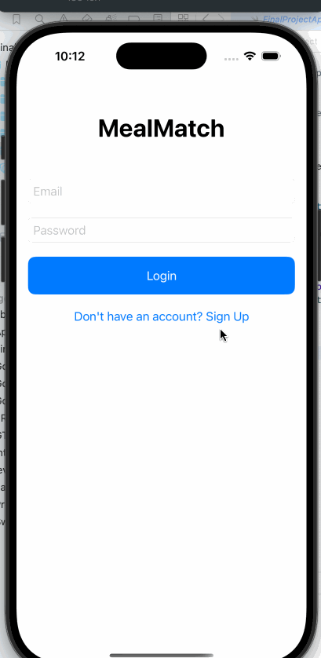
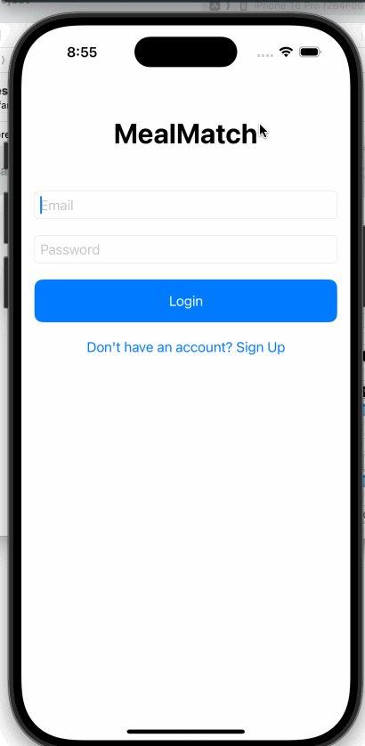

# **MealMatch**

## **Table of Contents**

1. [Overview](#Overview)
2. [Product Spec](#Product-Spec)
3. [Wireframes](#Wireframes)
4. [Schema](#Schema)

---

## **Overview**

### **Description**

**MealMatch** is an app designed to help users find personalized recipes based on their preferences, dietary restrictions, and available ingredients. The app features a swipeable interface for discovering new meal ideas and stores favorite recipes for easy access. Users can log in to save their preferences and access their saved recipes across devices.

### **App Evaluation**

- **Category**: Lifestyle / Food & Drink
- **Mobile**: Yes, mobile app only
- **Story**: The app tells the story of a personalized meal discovery journey. Users explore recipes, save favorites, and find meals that match their specific dietary needs.
- **Market**: MealMatch targets food enthusiasts, health-conscious individuals, and people with specific dietary preferences (e.g., vegetarian, gluten-free).
- **Habit**: The app is used occasionally when users are planning meals or looking for inspiration.
- **Scope**: Broad in terms of recipe discovery, but narrow in terms of features focused on food preferences, saving favorites, and meal planning.

---

## **Product Spec**

### **1. User Stories (Required and Optional)**

**Required Must-have Stories**

- [X] User can create an account to register and save recipes.
- [X] User can log in and access their account to view saved recipes.
- [X] User can swipe through recipes and save their favorites.
- [X] User can access the **Preferences Screen** to select dietary preferences (e.g., vegetarian, keto, gluten-free).
- [X] Recipes displayed in the **Home Feed** are filtered based on the saved preferences.
- [X] User can log out of their account.

**Optional Nice-to-have Stories**

- User can edit their profile (e.g., dietary preferences, favorite cuisine).
- User can update or reset preferences at any time.
- User can search for recipes based on ingredients they have at home.

---

### **2. Screen Archetypes**

- [X] **Login Screen**
  * Required User Feature: User can log in with their account credentials.
  * User can register for a new account if they don’t have one.

- [X] **Register Screen**
  * Associated required user story: User can create a new account by providing necessary details (email and password).
  * User can register and be redirected to the **Login Screen** upon successful account creation.
  
- [X] **Home Feed Screen**
  * Associated required user story: User can swipe through meal options and save favorites.

- [X] **Preferences Screen**
  * Required User Feature: User can select dietary preferences (e.g., vegetarian, keto, gluten-free) from a list of filters supported by the Spoonacular API.
  * User can save preferences, and these preferences will be applied to the recipes shown on the **Home Feed** screen.

- [X] **Recipe Details Screen**
  * Associated required user story: User can view the details of a recipe in their favorites.

- [X] **Favorite Recipes Screen**
  * Associated required user story: User can view all saved recipes in one place.
    
- [X] **Settings Screen**
  * Associated required user story: User can log out, view their preferences, and view their email.

---

### **3. Navigation**

**Tab Navigation** (Tab to Screen)

- [X] **Home Feed** - The default screen where users can discover recipes.
- [X] **Favorites** - A list of recipes that users have saved to their profile.
- [X] **Prefrences** - Preferences to filter recipes.

**Flow Navigation** (Screen to Screen)

- [X] **Login Screen**
  * Leads to **Home Feed Screen** upon successful login or **Sign Up Screen** if the user wants to make an account.
    
- [X] **Sign Up Screen**
  * Leads to **Home Feed Screen** once an account is created
  
- [X] **Home Feed Screen**
  * Leads to **Favorites Screen** when the favorites button is tapped.

- [X] **Preferences Screen**
  * Leads to **Home Feed** (with applied filters)

- [X] **Favorites Screen**
  * Leads to **Recipe Details Screen** when a saved recipe is tapped.
     
- [X] **Settings Screen**
  * Leads to **Login Screen** when log out button is tapped and the **Preferences Screen** if the prefrences button is tapped.

---
## **Sprint Progress**

### **Sprint 1**

### **Sprint 2**

## **Wireframes**

---

### **Schema**

#### **Models**

**User**

| Property      | Type    | Description                                          |
|---------------|---------|------------------------------------------------------|
| username      | String  | Unique identifier for the user                       |
| email         | String  | User's email address for login                       |
| password      | String  | User's password for authentication                   |
| dietaryPrefs  | String  | User's dietary preferences (e.g., vegetarian, gluten-free) |
| savedRecipes  | Array   | List of saved recipes (IDs or references to recipes)  |

**Recipe**

| Property      | Type    | Description                                          |
|---------------|---------|------------------------------------------------------|
| title         | String  | Name of the recipe                                  |
| ingredients   | Array   | List of ingredients required for the recipe         |
| instructions  | String  | Instructions to prepare the recipe                  |
| imageUrl      | String  | URL to an image of the dish                         |
| prepTime      | String  | Preparation time for the recipe                     |
| servings      | String  | Number of servings                                  |

#### **Networking**

- **[POST] /register** - To create a new user account.
- **[POST] /login** - To log in a user.
- **[GET] /recipes** - To fetch a list of recipe options.
- **[POST] /favorites** - To save a recipe to a user's favorites.
- **[GET] /favorites** - To retrieve a user's saved recipes.
- **[GET] /recipes/complexSearch** - To retrieve recipes based on dietary preferences (using filters like `vegetarian`, `keto`, `glutenFree`, etc.) from the Spoonacular API.
  - Parameters: `diet`, `cuisine`, `intolerances`, etc.
  - Example request: `/recipes/complexSearch?diet=vegetarian&intolerances=gluten`

- **[POST] /user/preferences** - To save the selected dietary preferences for the user (in the database or app storage).
  - Parameters: `userId`, `preferences` (array of selected dietary preferences).

---

